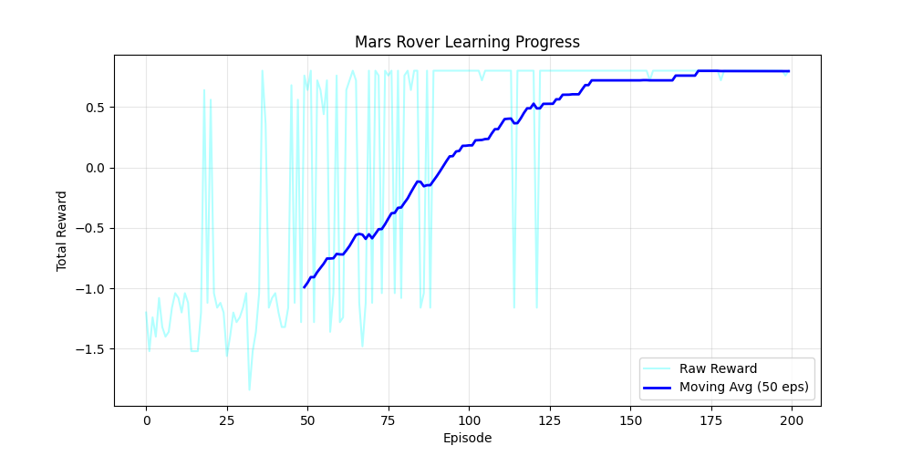
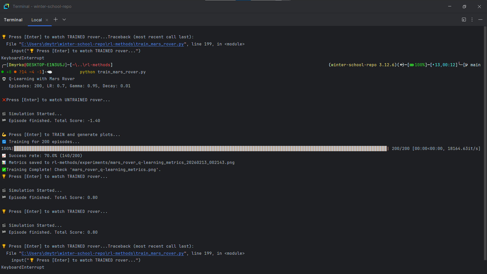

# 🔴 Mars Rover Reinforcement Learning Project

## 🎯 Project Goal
This project implements a Reinforcement Learning agent (Q-Learning) to solve a custom "Mars Rover" environment. The goal is to navigate a rover to water deposits while avoiding craters.

* **Environment:** Custom Gymnasium env (reskinned FrozenLake-v1)
* **Algorithm:** Q-Learning (Tabular)
* **Success Rate:** 100%

## 📊 Training Results (Evidence)
Here is the learning curve. The left graph shows the Total Reward reaching 1.0 (Success), and the right graph shows the Steps decreasing to 6 (Optimal Path).

## 💻 Terminal Output
Proof of 100% success rate after training:

## 🚀 Gameplay Demo
Watch the trained agent navigate autonomously:

